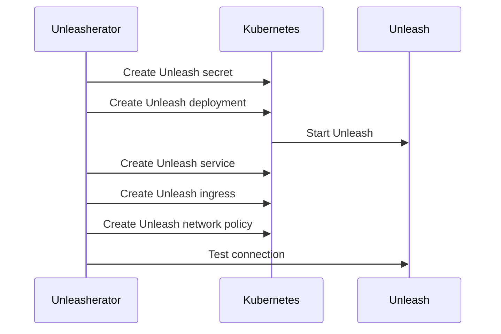

# Unleasherator

Kubernetes operator for managing [Unleash](https://getunleash.io) - the open-source feature toggle service.

Currently supports the following resources:

- [x] [Unleash](./docs/unleash.md)
- [x] [ApiToken](./docs/apitoken.md)
- [ ] [RemoteUnleash](./docs/remoteunleash.md)
- [ ] [Federation](./docs/federation.md)
- ~~[ ] Project~~*
- ~~[ ] Environment~~*

*These resources are not supported by the Unleash Open Source version and we don't have any plans to support them in this operator.

## Description

Unleasherator is a Kubernetes operator for managing Unleash instances and API tokens across multiple clusters or environments.

### Creating an Unleash instance

The following example can be used with [bitnami/postgresql][bitnami-postgresql] helm chart to create an Unleash instance with a local postgresql database.

[bitnami-postgresql]: https://artifacthub.io/packages/helm/bitnami/postgresql

```yaml
apiVersion: unleash.nais.io/v1alpha1
kind: Unleash
metadata:
  name: unleash
spec:
  size: 1
  database:
    secretName: postgres-postgresql
    secretPassKey: postgres-password
    host: postgres-postgresql
    databaseName: postgres
    port: "5432"
    user: postgres
    ssl: "false"
  networkPolicy:
    enabled: true
    allowDNS: true
    extraEgressRules:
    - to:
        - podSelector:
            matchLabels:
              app.kubernetes.io/name: postgresql
      ports:
        - protocol: TCP
          port: 5432
```

Sequence of events:



## Getting Started

You’ll need a Kubernetes cluster to run against. You can use [KIND](https://sigs.k8s.io/kind) to get a local cluster for testing, or run against a remote cluster.

**Note:** Your controller will automatically use the current context in your kubeconfig file (i.e. whatever cluster `kubectl cluster-info` shows).

### Running on the cluster

1. Install Instances of Custom Resources:

```sh
kubectl apply -f config/samples/
```

2. Build and push your image to the location specified by `IMG`:

```sh
make docker-build docker-push IMG=<some-registry>/unleasherator:tag
```

3. Deploy the controller to the cluster with the image specified by `IMG`:

```sh
make deploy IMG=<some-registry>/unleasherator:tag
```

### Uninstall CRDs

To delete the CRDs from the cluster:

```sh
make uninstall
```

### Undeploy controller

UnDeploy the controller to the cluster:

```sh
make undeploy
```

## Contributing

// TODO(user): Add detailed information on how you would like others to contribute to this project

### How it works

This project aims to follow the Kubernetes [Operator pattern](https://kubernetes.io/docs/concepts/extend-kubernetes/operator/)

It uses [Controllers](https://kubernetes.io/docs/concepts/architecture/controller/)
which provides a reconcile function responsible for synchronizing resources untile the desired state is reached on the cluster

### Test It Out

1. Install the CRDs into the cluster:

```sh
make install
```

2. Run the controller in your cluster:

Since the controller needs to reach the Unleash instance it can not run locally, but must be deployed to the cluster.

```sh
make docker-build deploy logs
```

### Modifying the API definitions

If you are editing the API definitions, generate the manifests such as CRs or CRDs, and corresponding Helm charts using:

```sh
make generate manifests helm
```

**NOTE:** Run `make --help` for more information on all potential `make` targets

More information can be found via the [Kubebuilder Documentation](https://book.kubebuilder.io/introduction.html)

## License

MIT License

Copyright (c) 2023 NAV

Permission is hereby granted, free of charge, to any person obtaining a copy
of this software and associated documentation files (the "Software"), to deal
in the Software without restriction, including without limitation the rights
to use, copy, modify, merge, publish, distribute, sublicense, and/or sell
copies of the Software, and to permit persons to whom the Software is
furnished to do so, subject to the following conditions:

The above copyright notice and this permission notice shall be included in all
copies or substantial portions of the Software.

THE SOFTWARE IS PROVIDED "AS IS", WITHOUT WARRANTY OF ANY KIND, EXPRESS OR
IMPLIED, INCLUDING BUT NOT LIMITED TO THE WARRANTIES OF MERCHANTABILITY,
FITNESS FOR A PARTICULAR PURPOSE AND NONINFRINGEMENT. IN NO EVENT SHALL THE
AUTHORS OR COPYRIGHT HOLDERS BE LIABLE FOR ANY CLAIM, DAMAGES OR OTHER
LIABILITY, WHETHER IN AN ACTION OF CONTRACT, TORT OR OTHERWISE, ARISING FROM,
OUT OF OR IN CONNECTION WITH THE SOFTWARE OR THE USE OR OTHER DEALINGS IN THE
SOFTWARE.
