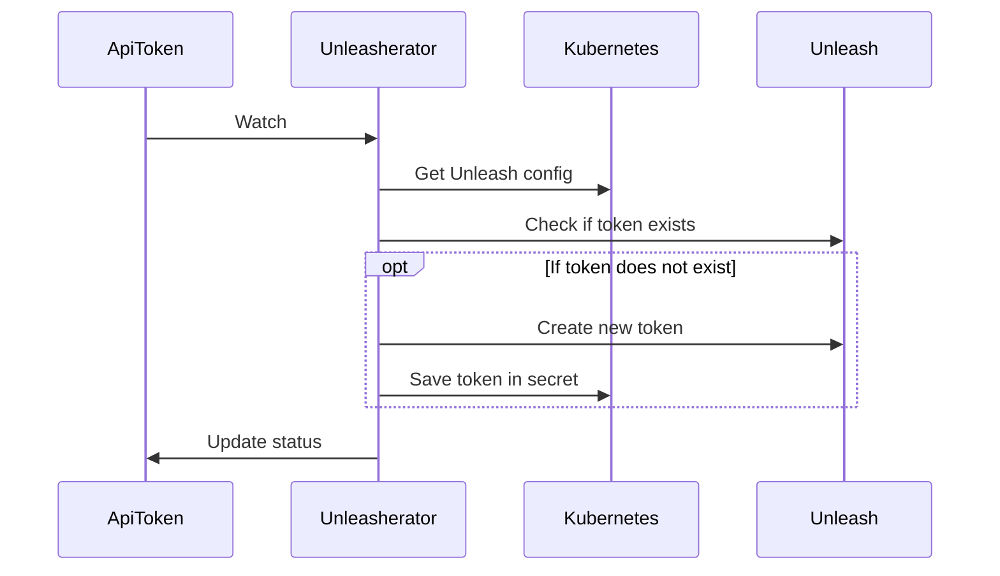

# ApiToken

Implementation status: `beta`

`ApiToken` is a resource that allows you to create API tokens for an Unleash instance.

## Implementation

Creates a new unleash API token for the Unleash instance specified in the `unleashInstance` field.
This can be either an `Unleash` or a `RemoteUnleash` resource in the same namespace.



The token will be stored in secret in the same namespace as the `ApiToken` resource. The name of the secret is specified in the `secretName` field and contains two keys:

- `UNLEASH_SERVER_API_TOKEN` - the token itself
- `UNLEASH_SERVER_API_URL` - the URL of the Unleash instance (remember to add `/api` to the end when authenticating to the Unleash API)

## Spec

```yaml
apiVersion: unleash.nais.io/v1
kind: ApiToken
spec:
  # The Unleash instance to create the token for
  unleashInstance:
    apiVersion: unleash.nais.io/v1
    kind: Unleash
    name: my-unleash-instance

  # The name of the secret to store the token in
  secretName: unleash-api-token

  # Token type (optional, can be either 'CLIENT' or 'FRONTEND')
  # defaults to 'CLIENT'
  type: CLIENT

  # Environment the token is valid for (optional)
  # defaults to 'development'
  environment: development

  # Projects the token is valid for (optional)
  # defaults to '*' (all projects)
  projects:
    - my-project
    - my-other-project
```
