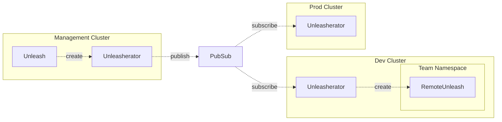

# Federation

The purpose of the federation feature is to allow you to create a single Unleash instance that can be shared across multiple clusters. This is useful if you have multiple environments that want to use Unleash, but you don't want to create a separate Unleash instance for environment.



In the example above we have three clusters: a management cluster, a dev cluster and a prod cluster. The management cluster is where the Unleash instance is created. The dev and prod clusters are where the teams are deploying their applications.

The management cluster has an Unleasherator instance that is responsible for creating the Unleash instance with a corresponding admin API token. The management Unleasherator publishes a message to a PubSub topic when it has created the Unleash instance along with the admin API token. The dev and prod clusters both have Unleasherator instances that are subscribed to the PubSub topic. When dev and prod Unleasherator instances receives the message, they creates a `RemoteUnleash` and an `AdminApiToken` resource in the correct namespace.

## Configuration

For Unleasherator to be able to create the Unleash instance, it needs to be configured with the correct PubSub topic. The following configuration options are available for Unleasherator Helm chart:

| Name                                                           | Description                                                           | Default |
| -------------------------------------------------------------- | --------------------------------------------------------------------- | ------- |
| `controllerManager.manager.env.federationClusterName`          | Cluster name                                                          | `""`    |
| `controllerManager.manager.env.federationPubsubMode`           | Federation mode, either `"publish"`, `"subscribe"` or `""` (disabled) | `""`    |
| `controllerManager.manager.env.federationPubsubGcpProjectId`   | GCP project ID for PubSub topic                                       | `""`    |
| `controllerManager.manager.env.federationPubsubSubscriptionId` | PubSub subscription ID                                                | `""`    |
| `controllerManager.manager.env.federationPubsubTopic`          | PubSub topic                                                          | `""`    |

The following configuration options are available for the individual Unleash instance:

```yaml
apiVersion: unleash.nais.io/v1
kind: Unleash
metadata:
  name: my-unleash
  namespace: my-namespace
spec:
  federation:
    enabled: true
    namespaces:
      - namespace-a
      - namespace-b
    clusters:
      - cluster-a
      - cluster-b
    secretNonce: secret-nonce
```

| Name                     | Description                                                           | Default |
| ------------------------ | --------------------------------------------------------------------- | ------- |
| `federation.enabled`     | Enable federation for the specific Unleash instance                   | `false` |
| `federation.namespaces`  | Namespaces to federate Unleash to create `RemoteUnleash` instances in | `[]     |
| `federation.clusters`    | Clusters to federate Unleash to create `RemoteUnleash` instances in   | `[]`    |
| `federation.secretNonce` | Secret nonce used for the secret resource name                        | `""`    |
