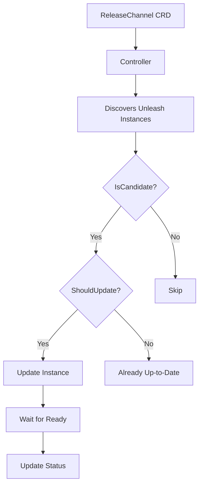

# ReleaseChannel CRD

The ReleaseChannel Custom Resource Definition (CRD) provides a GitOps-friendly way to manage and coordinate upgrades of multiple Unleash feature flag server instances across a Kubernetes cluster.

## Overview

Instead of manually updating individual Unleash instances when a new version is released, the ReleaseChannel CRD allows you to:

- Define a target image version centrally
- Automatically roll out updates to matching Unleash instances
- Implement canary deployments for safer rollouts
- Control the pace of rollouts with parallel deployment limits
- Monitor rollout progress through rich status information

## Architecture



## Key Features

### 1. **Automatic Instance Discovery**
- Finds Unleash instances that reference the ReleaseChannel by name
- Uses `IsCandidate()` method to determine eligibility
- Works within namespace boundaries

### 2. **Intelligent Update Logic**
- Only updates instances that need it via `ShouldUpdate()` method
- Compares current `CustomImage` with ReleaseChannel target image
- Skips instances already running the target version

### 3. **Canary Deployment Strategy**
- Deploy to canary instances first
- Wait for canary instances to be ready before proceeding
- Use label selectors to identify canary instances
- Configurable enable/disable per ReleaseChannel

### 4. **Parallel Deployment Control**
- Configure maximum parallel deployments via `maxParallel`
- Prevents overwhelming cluster resources
- Default: 1 (sequential deployments)

### 5. **Rich Status Reporting**
- Total instances managed
- Instances up-to-date
- Canary instance statistics
- Completion status
- Last reconciliation time
- Kubernetes conditions for detailed status

## Configuration

### Basic ReleaseChannel

```yaml
apiVersion: unleash.nais.io/v1
kind: ReleaseChannel
metadata:
  name: unleash-stable
  namespace: unleash-system
spec:
  image: "unleashorg/unleash-server:5.7.0"
```

### Advanced ReleaseChannel with Canary

```yaml
apiVersion: unleash.nais.io/v1
kind: ReleaseChannel
metadata:
  name: unleash-beta
  namespace: unleash-system
spec:
  image: "unleashorg/unleash-server:5.8.0-beta.1"
  strategy:
    maxParallel: 3
    canary:
      enabled: true
      podSelector:
        matchLabels:
          deployment: "canary"
```

### Unleash Instance Configuration

```yaml
apiVersion: unleash.nais.io/v1
kind: Unleash
metadata:
  name: unleash-production
  namespace: unleash-system
  labels:
    deployment: "production"
spec:
  database:
    url: "postgres://unleash-db:5432/unleash"
  # Connect to ReleaseChannel
  releaseChannel:
    name: unleash-stable
```

## Status Monitoring

The ReleaseChannel provides comprehensive status information:

```yaml
status:
  conditions:
  - type: Reconciled
    status: "True"
    reason: ReconcileSuccess
    message: ReleaseChannel reconciled successfully
  instances: 5
  instancesUpToDate: 5
  canaryInstances: 2
  canaryInstancesUpToDate: 2
  completed: true
  lastReconcileTime: "2025-08-05T10:30:00Z"
  version: "unknown"
```

### Status Fields

- **instances**: Total number of Unleash instances managed by this ReleaseChannel
- **instancesUpToDate**: Number of instances running the target image
- **canaryInstances**: Number of instances identified as canary instances
- **canaryInstancesUpToDate**: Number of canary instances running the target image
- **completed**: Boolean indicating if all instances are up-to-date
- **lastReconcileTime**: Timestamp of last reconciliation

### kubectl Commands

Monitor ReleaseChannel status:
```bash
kubectl get releasechannels
kubectl describe releasechannel unleash-stable
```

View detailed status:
```bash
kubectl get releasechannel unleash-stable -o yaml
```

## Deployment Strategies

### 1. Sequential Deployment (Default)
```yaml
spec:
  strategy:
    maxParallel: 1  # Default
```

### 2. Parallel Deployment
```yaml
spec:
  strategy:
    maxParallel: 5  # Deploy to 5 instances simultaneously
```

### 3. Canary-First Deployment
```yaml
spec:
  strategy:
    maxParallel: 2
    canary:
      enabled: true
      podSelector:
        matchLabels:
          tier: "canary"
```

## Integration Points

### 1. **Unleash Controller Integration**
- ReleaseChannel updates `CustomImage` field
- Unleash controller handles the actual deployment
- Waits for Unleash instance to become ready

### 2. **RBAC Permissions**
- Read/write ReleaseChannel resources
- Read/write Unleash resources
- Update status subresources

### 3. **Event Recording**
- Success/failure events for each instance update
- Canary-specific events
- Integration with Kubernetes event system

## Troubleshooting

### Common Issues

1. **Instances not updating**
   - Check if `releaseChannel.name` matches in Unleash spec
   - Verify namespace alignment
   - Check RBAC permissions

2. **Canary deployment not working**
   - Verify label selector matches canary instance labels
   - Ensure `canary.enabled: true`
   - Check instance labeling

3. **Slow rollouts**
   - Increase `maxParallel` for faster deployments
   - Check individual Unleash instance readiness
   - Monitor resource constraints

### Debugging Commands

```bash
# Check ReleaseChannel logs
kubectl logs -l app.kubernetes.io/name=unleasherator -c manager

# Check events
kubectl get events --field-selector involvedObject.kind=ReleaseChannel

# Check Unleash instance status
kubectl get unleash -o wide
```

## Best Practices

1. **Use descriptive names** for ReleaseChannels (e.g., `unleash-stable`, `unleash-canary`)

2. **Start with canary deployments** for production environments

3. **Monitor rollout progress** using status fields and events

4. **Use appropriate `maxParallel`** settings based on cluster capacity

5. **Test ReleaseChannels** in development environments first

6. **Use GitOps workflows** to manage ReleaseChannel definitions

## Future Enhancements

Potential improvements could include:

- **Health checks**: Verify Unleash instances are healthy before proceeding
- **Rollback capabilities**: Automatic rollback on deployment failures
- **Advanced strategies**: Blue/green deployments, percentage-based rollouts
- **Cross-namespace support**: Manage instances across multiple namespaces
- **Integration hooks**: Webhooks for external notifications
- **Metrics integration**: Prometheus metrics for rollout monitoring

## Security Considerations

- ReleaseChannels operate within namespace boundaries
- RBAC controls access to ReleaseChannel operations
- Image validation should be handled by admission controllers
- Consider using signed images for production deployments
